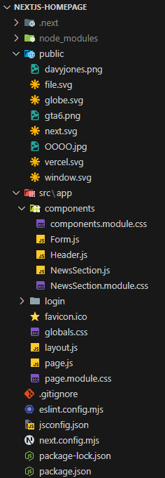

## 🖼 Estrutura do Projeto

Visualização da estrutura de pastas atual:



## 🛠 Tecnologias Utilizadas

- **Next.js** – Framework React para aplicações web otimizadas
- **React** – Biblioteca JavaScript para criação de interfaces de usuário
- **Next Fonts** – Utilização das fontes `Geist` e `Geist Mono`
- **CSS Modules** – Estilo com escopo local para evitar conflitos
- **Vercel** – Hospedagem e deploy contínuo

## ▶️ Como Rodar o Projeto

Instale as dependências:

```bash
npm install
````

Inicie o servidor de desenvolvimento:

```bash
npm run dev
# ou
yarn dev
# ou
pnpm dev
# ou
bun dev
```

Abra [http://localhost:3000](http://localhost:3000) no navegador.

## 🧩 Componentes

* `Header.js` – Exibe o título e botão de login no topo
* `Form.js` – Formulário dinâmico com modo de login e cadastro
* `NewsSection.js` – Sessão de notícias (ou conteúdo principal)
* `layout.js` – Define fontes e estrutura base da aplicação

## 🎨 Estilização

* `globals.css` – Estilos globais aplicados à aplicação
* `components.module.css` – Estilo local para `Header`, `Form`, etc.
* `NewsSection.module.css` – Estilo específico para o componente de notícias
* `page.module.css` – Estilo da página principal (`page.js`)

## 📦 Funcionalidades

* Alternância entre **login e cadastro** no formulário
* Layout responsivo com uso de **fontes otimizadas**
* Navegação entre páginas com **roteamento Next.js**
* Estilo modularizado para fácil manutenção